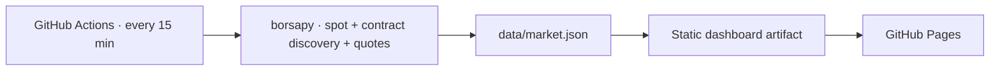

# Vade — USD/TRY VİOP Futures

A zero-backend GitHub Pages dashboard for the USD/TRY spot rate and every listed
USD/TRY futures contract on Borsa İstanbul's VİOP market. Market data is pulled
with [borsapy](https://github.com/saidsurucu/borsapy) and redeployed every 15
minutes by GitHub Actions.

## What it shows

- Current USD/TRY spot, daily range, and daily change
- Automatic discovery of new dated USD/TRY VİOP contracts
- Last price, daily change, bid/ask, volume, and premium to spot
- Official contract maturity date and calendar days remaining
- Responsive price and implied-yield curves plus the full contract board
- Daily, 30-day monthly, and 365-day annualized yields in the chart and contract table
- Snapshot age, delayed-data state, and one-click refresh

Maturity is calculated as the final **full** Turkish business day of each
contract month. Weekends, public holidays, and half-day official holidays are
excluded in line with [Borsa İstanbul's FX futures specification](https://www.borsaistanbul.com/en/markets/viop/futures/fx-futures).

## How it works



The scheduled job only replaces the live site after a complete, valid snapshot
is produced. If upstream market data is temporarily unavailable, the job fails
and the previous successful Pages deployment stays online.

The yield curve starts with the gross daily factor
`(contract price / spot rate)^(1 / days left)`. The chart converts the selected
1-, 30-, or 365-day compounded factor to net percentage yield by subtracting
one and multiplying by 100.

## Publish on GitHub Pages

1. Push this repository to GitHub with `main` as the default branch.
2. Open **Settings → Pages** and choose **GitHub Actions** as the source.
3. Open **Actions** and run **Refresh market data and deploy Pages**, or wait for
   the push-triggered run.

The same workflow runs at `*/15 * * * *` and can also be started manually.
GitHub may delay scheduled jobs during periods of high load, and scheduled
workflows in inactive public repositories can be disabled after 60 days.

## Run locally

Python 3.10 or newer is required (the workflow uses Python 3.12).

```bash
python -m venv .venv
source .venv/bin/activate
python -m pip install -r requirements.txt
python -m unittest discover -s tests -v
python scripts/update_data.py
python -m http.server 8000
```

Then open <http://localhost:8000>.

## Data notes

- Futures discovery uses `borsapy.viop_contracts("USDTRY", full_info=True)`.
- Quotes use `borsapy.TradingViewStream`; the borsapy VİOP table provides a
  fallback and supplementary turnover data.
- Spot uses borsapy's 15-minute `FX("USD")` intraday history, with
  `FX("USD").current` as a fallback.
- The dashboard polls its deployed JSON every minute, while the published
  snapshot is rebuilt on the 15-minute GitHub Actions schedule.
- VİOP and TradingView market data may be delayed by approximately 15 minutes.

This project is for personal and educational use only. It is not investment
advice. Review borsapy's upstream data-license disclaimer before use; commercial
market-data use may require a Borsa İstanbul license.
